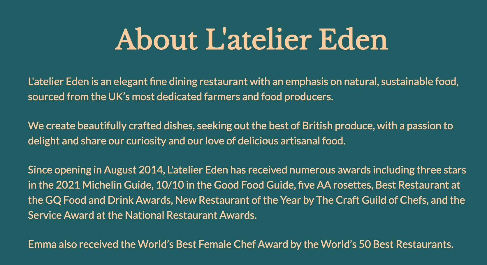

# L'atelier Eden

- You can find the deployed website [here](https://gabriel-alves-p.github.io/l-atelier-eden/).

- Milestone Project 1 - A User-Centric Project as part of Code Institute's Software Development Course.

## Author
Gabriel Alves

## Project Overview

This website was created as a user-centric project with the main goal of generating business by the means of a booking form whilst providing any information the customer might like to enquire about (E.g. about us information, menus, contact information, location and job applications). The website consists a landing page which has a hero video with a logo standing out in its center, an about us section, a menus section and a contact details section. It then has two separate pages dedicated to job applications and a booking form, respectively. All pages share the same fixed navigation bar at the top and footer at the bottom.

## UX

### Project Goals

- The website targets adults within the UK whom are highly eager to indulge in a fine-dining experience out of the ordinary and for skilled hospitality workers looking to make the next move in their careers.

- The website was designed to be easy to read and intuitive, with information about the restaurant, menus, contact details (including social media links) and our address all found in the home page.

- The footer contains policy information and gives the user the option to sign up to our weekly newsletter, to stay in touch and make the restaurant feel that little bit friendlier.

- The job application form and booking forms have their own dedicated pages to make the action of interacting with the restaurant feel like an activity separate from the informative part of the website and a more immersive experience.

- The website was also designed with a thought of "less is more" kept in mind, whilst it showcases luxury, it is also simple enough to be scanned by the user very quickly and the font styles demonstrate that.

- The website is responsive from the largest desktop viewports to the smallest phone viewports.

#### User Goals

> - As a new customer, I want to know what type of dining the restaurant offers (e.g. casual dining, fine dining, sharing plates etc.) upon reaching the landing page, so I can decide to either leave or stay within the first scan.
> - As a new customer, I want to easily find out more information about the restaurant, its accolades and the Chef whom runs the restaurant, so I know what kind of standards to expect.
> - As a new customer, I want to find out more about menus and prices, so I can decide wether the cuisine suits my taste and/or is worth the price.
> - As a new customer, I want to be able to see plenty of pictures of the food, so I can best decide wether to go ahead and book a table or not.
> - As a new customer, I want to be able to find out if the restaurant can accomodate any of my possible dietary requirements (e.g. veganism, vegetarianism, allergies, etc.), so I can go ahead with the booking or leave the page.
> - As a new customer, I want to be able to find out the address of the restaurant without having to contact its customer services, so I can see how far I would have to travel were I to book a table.
> - As a new customer, I want to be able to find out about the restaurant's opening hours and to be able to contact them via a telephone number and/or email address.
> - As a new customer, I want to be able to view what the cancellation policy is and how it affects me.
> - Both as a new and existing customer, I want to be able to succesfully book a table for either lunch or dinner.
> - Both as a new and existing customer, I want to have the option of signing up to a newsletter, so I can hear more about special menu offers.
> - Both as a new and existing customer, I want to be positively impacted by the color tones of the website.
> - Both as a new and existing customer, I want to intuitively read and/or scan the website and find it easy on the eyes.
> - As an existing customer, I want to be able to find menus and menu prices, so I can see if they have changed.
> - As a job-seeker, I want to be able to find out more about the restaurant's ethos and what kind of cuisine and standards the restaurant works towards, so I can best decide if it suits me.
> - As a job-seeker, I want to be able to find out if the restaurant is currently hiring for the position I am looking for.
> - As a job-seeker, I want to be able to successfully apply for a role and know what to expect after doing so.

#### Developer Goals

> - As a developer, I hope to have exceeded my client's expectations.
> - As a developer, I hope to have created an aesthetically pleasing website.
> - As a developer, I hope to have learned more about my code writting skills and improve upon the mistakes made.
> - As a developer, I hope to have learned how to write cleaner code and implement such skill onto my next project.
> - As a developer, I hope to have learned more about myself and how to persevere upon encountering bugs in my code.

#### Website Owner Goals

> - As an owner, I want to easily express the luxiouriousness in the experience offered by my business.
> - As an owner, I want to make sure the user finds the website easy to read and intuitive.
> - As an owner, I want to showcase pictures of my restaurant and the food so customers may be drawn in.
> - As an owner, I want to make the booking action as easy and intuitive as possible, with as little information to be filled out as necessary for a successful booking.
> - As an owner, I want to have our contact information and opening hours displayed so new customers have option to get in touch with us would they choose to do so.
> - As an owner, I want to ultimately generate more business by means of a booking system.
> - As an owner, I want to provide potential job applicants with enough information about the website to help them decide wether the job would suit them or not.

### Design Choices

#### Strategy Plane

The website's ultimate goal is to advertise their work, accquire new customers and generate profit by means of showcasing the high standards in which the restaurant opperates to and how much care goes into producing such experiences for the customers.
The target audience are adults aged 20 years and over whom are interested in fine-dining.

#### Scope Plane

Features, based on the strategy plane, that made it onto the website include:
> - A hero video showcasing the restaurant's outdoors, indoors and table planning.
> - A logo that stands out over the hero video.
> - A fixed and simple navigation bar at the top of the screen.
> - An about us section explaining the restaurant's ethos and accolades.
> - Images of the food to separate the sections
> - A section showcasing our different menus and prices.
> - Images of the food next to each menu.
> - A section containing our opening hours, contact details and location with an iframe for an address on Google Maps.
> - A separate page containing information about job applications.
> - Images of staff working happily.
> - An application form containing text, email, file, reset and submit inputs.
> - A separate page containing information about how to make a booking.
> - A booking form containing text, email, number, date, radio and submit inputs.
> - A fixed and simple navigation bar across all pages.
> - A simple footer across all pages.

#### Structure Plane

The information on the home was designed to be structured by priority, so that the first thing the customer reads as they scroll down is a description of what the restaurant does and what it has achieved in the past. That gives the user more confidence as they scroll down to the second section, which contain the menus and the prices. Finally the user finds the contact information and address, grouped together.

The same format was followed across the bookings and job application pages, with a brief overview of the topic to give the user more information and confidence to scroll down and fill out the forms.

The same navigation bar and footer are found across all three pages, to provide the user with intuitiviness.

#### Skeleton Plane

At the early stages of UXD planning, it was decided that the navigation bar would be fixed at the top of the screen, containing links to each and every section on the website, being the main way the user will navigate through the website. A hero-video with the restaurant's logo highlighted in the center would be used to set the feeling for the website at the landing page.

Followed then by the 'about us' section, which would then contain two pictures that contrasted with the page's background color, to create a division.
It would then be followed by a brief introduction to the menus, then the menus would follow, covering 50% of the screen, each with an image linked to a dish on the menus covering the remaining 50% of the screen.

A 'contact us' section would then follow, as per the priority levels decided in the structure plane. This section would cover 100% of the screen width and contain both information about how to get in touch with the restaurant, should the user require to do so, and the location including a Google Maps iframe.

The landing page ends with a footer containing terms & conditions, privacy policy and cookie policy on the left side of the screen and an option to subscribe to the restaurant's newsletter on the right.

The careers and bookings pages would contain the same navigation bar and footer, with a heading and a few paragraphs introducing the user to the page, followed by the forms, which would contain the same styling and same fixed background style to keep in accordance with the website's design.

#### Colors

- The color palette was chosen with the thought of luxury in mind. The two colors chosen for the website's feel are represented by emerald-like and golden-like colors that definitely represent the type of experience the restaurant offers.

#### Typography

- The fonts were chosen purely aesthetically. The logo font (Libre Baskerville) was chosen to give the user a sense of finesse and class. Whilst the content font (Lato) was chosen to be a simple, clean and easy to read font, so it is easy on the eyes of the user whilst reading or scanning through the content.

- Heading font https://fonts.google.com/specimen/Libre+Baskerville?query=libre+
- Paragraph font https://fonts.google.com/specimen/Lato?query=lato

#### Images

- The images found on the website were chosen to showcase the culinary and the hospitality of the restaurant, they were chosen to contrast with the background color of the website and stand out from any other features on the website.
- The icons were chosen to be simple and have a minimal ::hover effect. They are there to add extra finesse to the menus and to give the social media links a more interesting look.
- The thought process behind these was "a picture speaks a thousand words".

#### Animations

- Social media icons scale up when hovered over.

#### Transitions

- Smooth scrolling added to the website when directed to a section on home page through the navigation bar.

- Hero images transition via means of a video added to the header.

### Wireframes

- Wireframes sketched for this project can be viewed [here](https://drive.google.com/file/d/1_isDYdImHXlCSWMB9GdZRoAzCxiXuB5I/view?usp=sharing).

### Features

This project consists of three distinct pages: home page, careers and bookings. They have all been designed to be responsive for all mobile and desktop devices.

#### Home Page

- It acts as the landing page for the website and contains all the main information the user could be looking for, structured in a priority order. It contains information about the restaurant, menus and prices, contact information and location. It was designed this way to be intuititve and make sure the user does not have to look hard at all to find important information.

#### Careers

- The careers page stands out on its own, separate from the main content, as it is my understanding most users will not be interested in this section. Nonetheless, it still feels very much a part of the same website, with the same type of heading and paragraph content to introduce you to the section, followed by staff pictures to give the page more of a purpose-filled feel, then it informs the user of the positions available for application, and finally the application form, kept as simple and in accordance with the design of the website as possible.

#### Booking

- The bookings page, much like the careers page, is found separate from the main content. It is however, for a different reason. The page is kept separate to make the act of booking a table exclusive and immersive to the user. It includes the same format of the careers page, a heading, paragraph content to inform the user, and then finally the booking form, where the user can submit their details in for an experience with the restaurant,

#### Navigation Bar

- All three pages share the same fixed navigation bar at the top, keeping in format with the intuitivity of the website, helping the user get anywhere, from anywhere.

#### Footer

- All three pages share the same footer at the bottom of the page, keeping it uniform and making sure the user can get to the footer regardless of which page they are on.

#### Responsiveness

- All pages have been designed to be responsive from the largest of desktop devices to the smallest of mobile devices.

### Future Features

- In the future I would like to implemment an OpenTable calendar iframe to the bookings form, making it easier to book a table.
- screenshot of calendar

- In the future, I would like to introduce separate pages for "terms of use, privacy policy & cookies policy".
- screenshot of footer-left

## Testing

### Validation Testing

- [CSS Validator](https://jigsaw.w3.org/css-validator/)
- [HTML Validator](https://validator.w3.org/)

### Cross Browser and Cross Device Testing

| TOOL / Device                 | BROWSER     | OS         | SCREEN WIDTH  |
|-------------------------------|-------------|------------|---------------|
| Real Phone: iPhone XS Max     | Safari      | iOs.       | S/M 414 x 896 |
| Real Phone: iPhone 12.        | Chrome      | iOs        | S  390 x 844  |
| Real Computer: MacBook Pro    | Firefox     | Big Sur    | L  1240 x 768 |
| Chrome DevTools: Surface Duo  | Chrome      | Android    | M  540 x 720  |
| Safari DevTools: iPad         | Safari      | iOs        | M 768 x 1024  |
| Chrome DevTools: iPad mini    | Chrome      | iOs        | M 768 x 1024  |
| Firefox DevTools: iPad Pro    | Firefox     | Android    | L 1024 x 1366 |
| Firefox DevTools: iPad Pro Hz | Firefox     | iOs        | L 1366 x 1024 |
| Real Computer: MacBook Pro XL | Safari      | Big Sur    | XL 1752 x 960 |

### Manual Testing

- Manual Testing for this project can be found [here](https://docs.google.com/spreadsheets/d/1acPB5xdVpJIHv4YUpYRCyhFIdUnEWh5nJjfzOq_zecE/edit#gid=87359594).

### Defect Tracking

- Defect Tracking for this project can be found [here](https://docs.google.com/spreadsheets/d/1b_xzFv6lWyq19zclKMnFeP_zos07qeLeMpvfBFZDBSY/edit#gid=891834841).

### Defects of Note

- Aligning radio buttons and their labels on the booking form was by far the bug that took the most attention to solve. It was solved with the help of my mentor (Malia Havlicek) by overriding a style set by an ID with the '!important' element.

- Smoothing out the edges of the logo background took some time also, it was finally solved by the use of the 'box-shadow' element, which I found whilst researching on [W3Schools](https://www.w3schools.com/).

- Since the Google Maps iFrame was imported with some styles pre-set, I found it difficult to override some of them and centralize the iFrame within it's parent division. I managed to solve this by using 'margin: 0 auto;' which was found in one of my lessons with Code Institute.

### Outstanding Defects

- A few margins need some slight adjusting for mobile viewports, will be done in future works.

## Accessibility

### Lighthouse Audits

### Keyboard Navigation

- The website has been tested for keyboard navigation and successfully allows the user to navigate the website with the tab key.

## Deployment

1. Go to repository created on GitHub.
2. Click on 'Settings'.
3. Scroll down and click on 'Pages' on the left hand side menu.
4. Select the 'Branch' 'master' and click on 'Save'.
5. Allow GitHub a few minutes to deploy the website and then refresh the page.
6. Website deployed.

## Credits

### Content

- The following content was taken from https://www.corebyclaresmyth.com/

- The following content was taken from https://www.lenclume.co.uk/restaurant

- The following content was taken from https://galvinrestaurants.com/

- The following content was taken from https://www.elystanstreet.com/

### Media

- The following media was taken from https://www.belmond.com/hotels/europe/uk/oxfordshire/belmond-le-manoir-aux-quat-saisons/

- The following media was taken from https://www.corebyclaresmyth.com/

- The following media was taken from https://trinityrestaurant.co.uk/

- The following media was taken from https://www.daviesandbrook.co.uk/

- The following media was taken from https://fontawesome.com/

### Acknowledgments

This is the section where you refer to code examples, mentors, blogs, stack overflow answers and videos that helped you accomplish your end project. Even if it's an idea that you updated you should note the site and why it was important to your completed project.

If you used a CodeInstitute Example project as a starting point. Make note of that here.